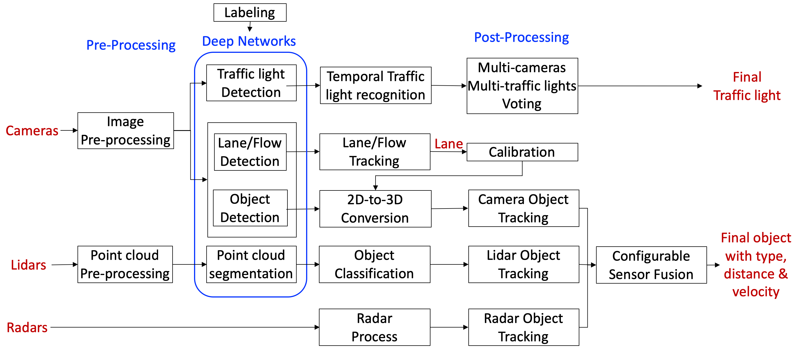

# Perception

## 介绍

- apollo5.0感知模块支持VLS-128 Lidar
- 支持深度学习
- 在线传感器标定
- 手动相机标定
- Close In-Path Object(CIPO)检测
- 可配置的传感器融合
- 消失点检测

感知模块使用多相机,雷达,激光去识别障碍物并且融合他们各自的轨迹并获得最终的track list. obstacle子模块检测,分类,和track 障碍物.子模块也预测障碍物运动和位置信息(如航向角和速度),对于车道线,通过后处理车道稀疏像素点构造相对于自车位置的从车道线实例(L0,L1,RO,R1等).

## Perception Module
- 架构

- 感知模块细节

## Input

- Lidar 数据
- Camera数据
- Radar 数据
- radar 外参文件(from YAML file)
- Camera 内外参文件(from YAML file)
- 自车速度和角速度(from localization)

## Output

- 3D障碍物 tracks,带位置,航向角,速度和分类信息
- 交通信号灯检测和识别

